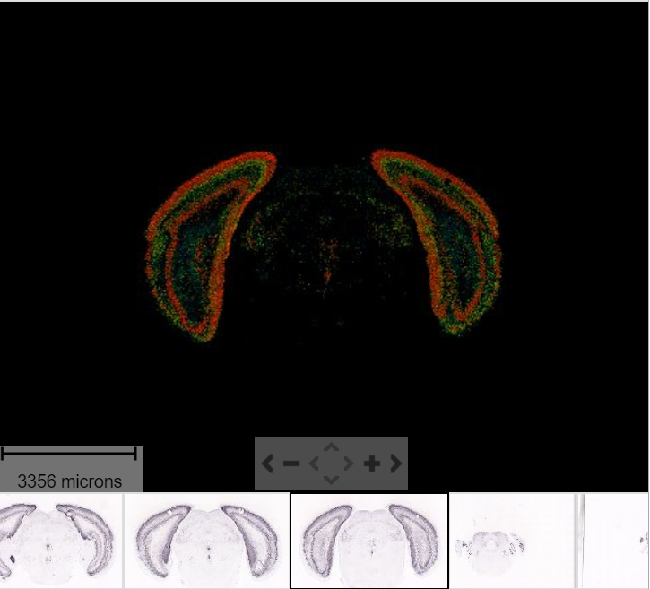
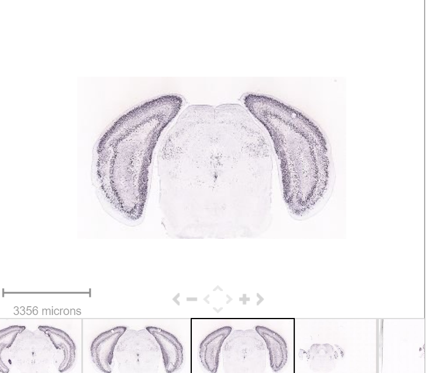
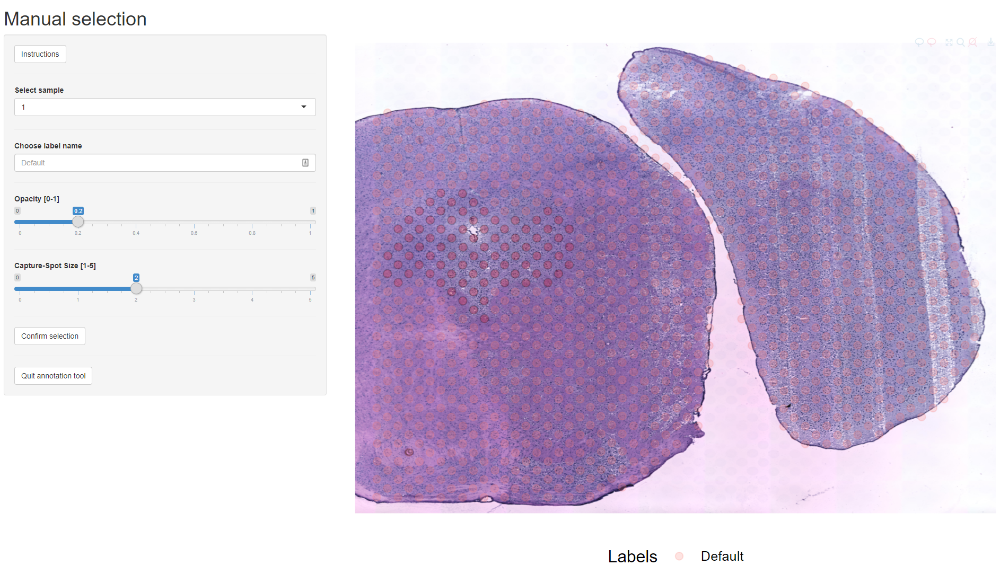

```{r setup, include=FALSE}
knitr::opts_chunk$set(echo = TRUE, message = FALSE, warning = FALSE)
```

# Installation

Using devtools, execute the following from the R console:

```{r, eval=FALSE}

devtools::install_github(
    "jbergenstrahle/STUtility"
   ,build_opts=c("--no-resave-data", "--no-manual")
)

```

```{r, echo=FALSE}

library(STutility)

```

# Info

## Short background of the Spatial Transcriptomics method 

---

The tutorial aims to lay the foundation of best practice for ST data analysis. At such, the user is probably already familiar with the underlying method and a detailed description is therefore found elsewhere. Interested readers are pointed to the original publication from 2016 (https://science.sciencemag.org/content/353/6294/78). 


In short, there are two main output components from an ST experiment; (i) the gene expression data and (ii) the image data. 

All the steps explained in this guide could be performed with only the expression data. However, the image data, apart from being fundamental to the biological interpretation, is used to filter out capture-spots that lies directly under the tissue. This filtering excludes the unwanted data points, lowering the memory burden of the data objects created as well as removing informational noise. 

An introductory animation is available on our website: http://www.spatialtranscriptomicsresearch.org/

### Spot adjustment and selection

The gene expression data consists of a count matrix with genes in rows and capture "spots" in columns. Each spot represents a small area on an ST array from which the captured transcripts have been barcoded with a unique sequence. The unique barcode makes it possible to map the transcripts onto a spatial position on the tissue section and would be equivalent to a cell specific barcode in scRNA-seq data but can tag a mixture of transcripts from multiple cells. The spatial position of a spot is an (x, y) coordinate that defines the centroid of the spot area. These spatial coordinates are stored in the spot ids (column names) and allows us to visualize gene expression (and other spot features) in the array grid system. However, if you want to overlay a visualization on top the HE image you want to make sure that the spot coordinates are exact in relation to morphological features of the image. When the spots are printed onto the ST array surface, they will sometimes deviate from the (x, y) coordinates given by the spot ids and should therefore be adjusted. In addition to the spot adjustment, you will also need to label the spots that are located directly under the tissue. Spot adjustment and selection can be done automatically using our [ST spot detector](https://github.com/SpatialTranscriptomicsResearch/st_spot_detector) web tool which outputs a table of adjusted coordinates and labels for the spots under tissue.

## A note on using STUtility for multiple sample analysis

The STUtility tool was developed with the goal of multiple sample inputs. As with all biological data, using multiple samples add power to the analysis and is a necessity to enable comprehensive insight which otherwise suffers from stochastic uncertainty. Within this vignette, we display how you can input multiple samples, look for aggravating circumstances like batch effects and missing data, apply methods to correct such if present, get a holistic picture of your data as well as conduct more in depth analysis in various ways.

## A note on the fundamental backbone of STUtility - The Seurat workflow

We have extensively tried different methods and workflows for handling ST data. While all roads lead to Rome, as of the date of this writing we find the Seurat approach [https://satijalab.org/seurat/] to be the most suited for this type of data. Seurat is an R package designed for single-cell RNAseq data. Obviously, this deviates from the data that the ST technology currently produce, as the resolution on the array implies that each capture-spot consists of transcripts originating from multiple cells. Nevertheless, the characteristics of the ST data resembles that of scRNAseq to a large extent. 

## A note about the new 10X Visium array

In late 2018, the company Spatial Transcriptomics was acquired by 10X Genomics, which since then have been developing the new version of the technological platform that our research group have been using in the past years, called _Visium_. There are some changes in the experimental protocol for the Visium, and the type of output and subsequently input to this R tool. Since our goal is to have this R tool compatible to past and future versions of the technology, both are supported. If you are working with the Visium platform, please see [The 10X Visium platform]. 

## A note about the naming conventions used

For users familiar with the Seurat workflow, there are a number of Seruat plotting functions, e.g. `Seeurat::FeaturePlot()`, those plotting functions all have a "ST version", which is called upon by adding "ST." prior to the original function name e.g. `STutility::ST.FeaturePlot()`.

The external STUtility functions are following a PascalCase convention. 

# Getting started

## Original ST platform

### Input files

After a typical ST experiment, we have the following three output files:

1. Count file
2. Spot detector output 
3. H&E image

To use the full range of functions within STUtility, all three files are needed for each sample. However, all data analysis steps that do not involve the H&E image can be performed with only the count file as input. 

---

To follow along this tutorial, download the test data set at TODO:[insert test data set link]. The downloadable content consists of count files, output from our spot detector tool, H&E stained images as well as an "infoTable" to read in the files into R.

### The infoTable 

The recommended method to read the files into R is via the creation of a "infoTable", which is a table with three columns "samples", "spotfiles" and "imgs". 

```{r, echo=FALSE}

samples <- c("Path to samples 1 ", "Path to samples 2")
spotfiles <- c("Path to spotfile 1", "Path to spotfile 2")
imgs <- c("Path to H&E image 1", "Path to H&E image 2")
data.frame(samples, spotfiles, imgs)
```

These columns are *mandatory* to include in the infoTable. However, spotfiles and imgs can be left empty if the user do not wish to include the image in the analysis workflow.

any number of _extra_ columns can be added with metadata. This information can then be used to e.g. coloring of plots and subsetting. These columns can be named as you like. 

Lets load the provided infoTable

```{r, eval=FALSE}

infoTable <- read.table("~/STUtility/inst/extdata/metaData_mmBrain.csv", sep=";", header=T, stringsAsFactors = F)[c(1, 5, 6, 7), ]

```


```{r, eval=FALSE, echo=FALSE}
infoTable
```

### Loading the samples

The provided count matrix consists of EnsambleIDs as gene names. Gene symbols are often a preference for easier reading, and we provide a transformation table accordingly. 

```{r, eval=FALSE}
#Transformation table for geneIDs
ensids <- read.table(file = list.files(system.file("extdata", package = "STutility"), full.names = T, pattern = "mouse_genes"), header = T, sep = "\t", stringsAsFactors = F)

```

We are now ready to load our samples and create a "seurat" object. 

Here, we demonstrate the creation of the seurat object, while also including some filtering by only keeping the genes that are found in at least 5 capture spots and a total count value >= 100. We also only keep the spots that contains >= 500 total transcripts. (Note: by default `prep.from.table()` will remove spots that are located outside of the tissue according to the infoTable. If your infoTable do not include paths to spotfiles, or, if you want to simply omit this step: set `spot.file=FALSE`). 

```{r, eval=FALSE}
#DOUBLE CHECK SO THAT THIS IS CORRECT NOW

#TODO: add warnings if ids missmatch. Check that ids are in the data.frame ...
se <- InputFromTable(infotable = infoTable, 
                      transpose = T, 
                      min.gene.count = 100, 
                      min.gene.spots = 5,
                      min.spot.count = 500, 
                      annotation = ensids)

```


```{r, eval=TRUE, echo=FALSE}

#Load preloaded data
load("/run/media/joey/KING-JOSEPH/JoeDocs/PhD/STUtility/STutility/inst/extdata/saved/multiple_sample_analysis_prealigned.RData")

```

## The 10X Visium platform

### Input files

After running the 10X SpaceRanger pipeline, the output includes:

1. Count file in H5 format
2. Barcode position file 
3. H&E image

To use the full range of functions within STutility, all three files are needed for each sample. However, all data analysis steps that do not involve the H&E image can be performed with only the count file as input. 

---

To follow along this tutorial, download the test data set at TODO:[insert test data set link]. The downloadable content consists of count files, output from our spot detector tool, H&E stained images as well as an "infoTable" to read in the files into R.

### 10x infoTable

The same format is used as the original ST platform, see \@ref(The-infoTable)

```{r, echo=FALSE, eval=FALSE}
#visium <- Read10X_h5("/run/media/joey/KING-JOSEPH/JoeDocs/PhD/STUtility/STutility/inst/extdata/10xVisium/142079_filtered.h5")

infoTable <- read.table("/run/media/joey/KING-JOSEPH/JoeDocs/PhD/STUtility/STutility/inst/extdata/infoTable_10x.csv", sep=",", header=T, stringsAsFactors = F)


```

### Loading the samples

To read in the 10x Visium .h5 files, the package `hdf5r` needs to be installed (`BiocManager::install("hdf5r")`). By default 10X Visium output format implies setting `transpose=F`. [There is a specified scaling factor for the H&E image. The picture with suffix "high_res" uses the default scaling factor of 0.1039393. However, is other pictures are used, specify the scaling factor when calling the _InputFromTable()_ function. All scaling factors are found in the scalefactors_json.json which you have in your 10X output folder] (OBS CHECK HOW THE WORKFLOW 10X IS SUPPOSED TO BE)

```{r, echo=FALSE, eval=FALSE}

se <- InputFromTable(infotable = infoTable, 
                      transpose = F,  #Transpose är F för 10x Visium
                      min.gene.count = 100, 
                      min.gene.spots = 5,
                      min.spot.count = 500)


```


# Loading and handling images

With the Seurat object created, we are ready to load the H&E images from the file paths provided in the infoTable. The LoadImages() function allow you to load the images into the Seurat object and will automatically save a scaled down version of each image that you can use for plotting.


```{r, eval=TRUE, echo=TRUE}

se <- LoadImages(se)

```


---

The core of an ST experiment is the interplay between quantitative RNAseq data and qualitative image data. Working in R, the handling of image information and plotting of multiple samples can get a bit cumbersome, especially if the images are of higher resolution. Typically, we rarely find much use of plotting multiple samples together with the tissue images within this framework. Instead, the general tip is to perform the various plots using only the expression data, and after finding anything of interest that warrants further analysis - take out that sample and plot it individually together with the stained tissue image. 

For example, we can visualize the number of RNA features and RNA counts on the ST array coordinates and quickly verify where we capture more material from the tissue.

NOTE: see the end of the vignette how to handle plotting if you are missing image/spot-files. 

```{r, fig.height=12, fig.width=8}
# TODO: make sure that levels are set in facets

ST.FeaturePlot(object = se, 
               features = c("nFeature_RNA", "nCount_RNA"), 
               palette = "heat",
               ncol = 1, 
               grid.ncol = 2, 
               pt.size = 0.5, 
               dark.theme = T)

```

If we want to overlay these spatial heatmaps on the HE image it is much easier to focus on one sample at the time. Handling large images gets clumsy so we recommend to work with down-scaled versions of the images that takes up less memory.

OBS: We have noted that some systems experience memory problems due to large size image information not being cleared when removing old objects. If this is the case, the user can set `time.resolve=TRUE`, which will add a small garbage collection step to avoid this issue.

NOTE: time.resolve is set to TRUE as default in the current version. This will imply that the process takes approx. 5sec longer per sample. Turn this off if annoyed. 

```{r, eval=FALSE}

system.time({se <- LoadImages(object = se, verbose = T)})
```

Using the loaded images, we can create masks around the tissue area, to hide the array background and allow for better visualization. 

OBS; The masking currently does _not_ work satisfactory for 10X Visium slides

```{r, eval=TRUE}
# TODO: Take care of warnings 

se <- MaskImages(object = se, verbose = F)

```

You can look at the HE images using the ImagePlot() function.The ImagePlot function will automatically label the samples from 1 to N where N is the total number of samples. If you are running the function within RStudio you can take advantage of the Viewer panel to explore the images. Setting method="raster" and the plot function will use the default plotting device in R. You can also change the layout of the images by forcing a different number of columns by setting ncols.


```{r, fig.width=12, fig.height=12, eval=TRUE, echo=TRUE}

# Plot HE images
ImagePlot(se, ncols = 3, method = "raster")

```

To overlay a spatial feature heatmaps on top of the HE image we use the FeatureOverlay() function. This function is similar to ST.FeaturePlot() but allows only one sample (specified by the sample.index argument) to be handled at the time. Note that the features are overlaid on top of the masked HE images where the background has been removed. If you want to use the raw images you can just specify type = "raw" to plot on the original images instead. Sometimes the masking algorithm will fail and you will end up with small pieces of the tissues erased. If this happens you can try to rerun the MaskImages() function with different parameter settings until you are satisfied.

```{r, fig.height=6, fig.width=13}
# TODO: fix warning
FeatureOverlay(object = se, 
              features = c("nFeature_RNA", "nCount_RNA"), 
              sample.index = 1,
              palette = "GrRd",
              alpha = 0.7)


```

### Individual transformations to images

If you follow along the test set in this vignette, you will notice that the samples are not quite aligned with respect to each other on the array. We have implemented a process to automatically align the images.

To demonstrate the effect:

```{r, fig.width=12, fig.height=12, eval=TRUE, echo=FALSE}
ImagePlot(se, method = "raster", type="masked") #For convience vignette hmtl look
```

Call the automatic alignment.

The automatic alignment method first tries to detect the tissue edges from each image. By default, the first image (`reference.index = 1`) is used as a reference but you can specify any sample with the `reference.index`option. Then, for each image, a transformation matrix is learned that can be used to map coordinates to the reference image. This alignment method will sometimes fail and in that case you can align the images manually instead using the `ManualAlignImages()` function. This is typically required when; (1) the tissue is bigger than the image and therefore outside the frame, (2) the tissue has a symmetrical shape (for example if the tissue has a round shape, it will be difficult to find an optimal alignment using the tissue edges), (3) the masking has failed.

The actual transformation is done using the `imwarp()` function from the imager R package using a "backward" transformation strategy. This method makes sure that every pixel is painted using linear interpolation so the aligned images will experience some quality loss.

```{r, eval=TRUE, fig.width=12, fig.height=12}
se <- AlignImages(se, verbose = F)

## Mirror image number 5 along y axis
#transforms <- list("5" = list("mirror.y" = T, "mirror.x" = T))

#se <- WarpImages(object = se, transforms)
```

And the result:

```{r, fig.width=12, fig.height=12}

ImagePlot(se, method = "raster")

```

The new alignments are stored in the Seurat object, and subsequent plotting functions will use this alignment as default. 

```{r, fig.width=6, fig.height = 6}

MultiFeatureOverlay(se, features = "Nrgn", 
                    sampleids = paste0(1:4),
                    palette = "GrRd",
                    method="raster")

#TODO:  "masked", "raw" eller "processed" add to documentation. 

```

The `type` parameter can be set to "masked", "raw" or "processed", to override the default use of processed masked images. 

```{r, eval=FALSE, fig.height = 6, fig.width = 12}

FeatureOverlay(object = se, features = c("Nrgn", "Cck"), 
               palette = "GrRd", sample.index = 2,
               type="raw")

FeatureOverlay(object = se, features = c("Nrgn", "Cck"), 
               palette = "GrRd", sample.index = 2,
               type="processed")

```


## Normalization and scaling

---

Each spot in a Spatial Transcriptomics dataset typically contains RNA from a mixture of cells so why would we apply a workflow that was developed for single-cell RNAseq data? We can calculate some properties to visually inspect the data to see that ST data have similar properties to that of scRNAseq data.

```{r, fig.width = 12, fig.height = 4}

library(Matrix)
library(magrittr)
library(dplyr)
library(ggplot2)

# Get raw count data 
umi_data <- GetAssayData(object = se, slot = "counts", assay = "RNA")
dim(umi_data)

# Calculate gene attributes
gene_attr <- data.frame(mean = rowMeans(umi_data),
                        detection_rate = rowMeans(umi_data > 0),
                        var = apply(umi_data, 1, var), 
                        row.names = rownames(umi_data)) %>%
  mutate(log_mean = log10(mean), log_var = log10(var))

# Obtain spot attributes from Seurat meta.data slot
spot_attr <- se[[c("nFeature_RNA", "nCount_RNA")]]

p1 <- ggplot(gene_attr, aes(log_mean, log_var)) + 
  geom_point(alpha = 0.3, shape = 16) + 
  geom_density_2d(size = 0.3) +
  geom_abline(intercept = 0, slope = 1, color = 'red') +
  ggtitle("Mean-variance relationship")

# add the expected detection rate under Poisson model
x = seq(from = -2, to = 2, length.out = 1000)
poisson_model <- data.frame(log_mean = x, detection_rate = 1 - dpois(0, lambda = 10^x))
p2 <- ggplot(gene_attr, aes(log_mean, detection_rate)) + 
  geom_point(alpha=0.3, shape=16) + 
  geom_line(data=poisson_model, color='red') +
  ggtitle("Mean-detection-rate relationship")

cowplot::plot_grid(p1, p2)

```

We can see from the mean-variance and Mean-detection-rate scatter plots that genes show overdispersion compared to what would be expected under a Poisson model. Because these properties are shared between ST and scRNAseq data we have reasoned that the workflow presented in the Seurat package should be applicable for ST data as well. It is important however to keep in mind that each spots contains a mixture of cell types and should be interpreted as a morphological unit in the context of a tissue section. 

In order to normalize the data we recommend using [variance stabilized transformation](https://www.biorxiv.org/content/10.1101/576827v1) available in the SCTransform function in Seurat as of v3.0. 

Following the rationale expressed above, we transform the data according to the Seurat workflow. Note: for comprehensive tutorials in the different options and workflow possibilities available within Seurat, we recommend looking at their website https://satijalab.org/seurat/  

```{r, eval=FALSE, warning=FALSE, message=FALSE} 

se <- SCTransform(se, vars.to.regress = c("sample", "nFeature_RNA"))

```

## Finding spatial expression patterns and areas of interest

The strength of untargeted whole transcriptome capture is the ability to perform unsupervised analysis and the ability to find spatial gene expression patterns. We've found good use of the dimensionality reduction method "ICA" (Independent Component Analysis) to find spatial expression patterns. An example is demonstrated below:

```{r, fig.width=16, fig.height=10, eval=FALSE}

se <- RunICA(se)

``` 


Different dimensionality reductions methods are supported via Seurat (`RunPCA()`, `RunTSNE`, `RunICA()`, `runUMAP()` ) and the output are stored in the Seurat object. 

We can then plot a variable number of dimensions across the samples.

```{r, fig.height=24, fig.width=24}

ST.DimPlot(se, dims = 1:8, ncol = 8, grid.ncol = 1, reduction = "ica", dark.theme = F, pt.size = 1, center.zero = T,palette = "RdBu")
#ST.DimPlot(se, dims = 1:5, reduction = "ica", dark.theme = T, cols = c("black", "cyan", "white"), center.zero = F, ncol = 4, grid.ncol = 1)
```

To extract the genes that drives the separation according to the dimensionality reduction, we can use the `ProjectDim()` function. Where we specify the dimensions of interest (here IC_1 and IC_3, which are regions that seems to confer a clear spatial expression histology. 

```{r}

ProjectDim(se, reduction = "ica", dims=c(1,3))

```


## Clustering

Clustering is a standard procedure in genomic analysis, and the methods for doing so are numerous. Here we demonstrate an example where we use the result of ICA to perform clustering. In the previous section, we demonstrated how to plot a subset of dimensions from the ICA output. Going through this list, we can notice the dimensions that are "spatially active", i.e. that seems to confer a spatial pattern along their axis. We can extract these dimensions:

```{r, fig.width=16, fig.height=10}
keep.dims <- c(1:12, 16:18, 21:28, 30:34, 40:41, 47, 49:50)
```

And then use them to construct a Shared Nearest Neighbor (SSN) Graph. 

```{r, eval=FALSE}
se <- FindNeighbors(object = se, dims = keep.dims, verbose = FALSE, reduction = "ica")
```

Followed by clustering using a modularity optimizer

```{r, eval=FALSE}
se <- FindClusters(object = se, verbose = FALSE)
```

And plotting of the clusters spatially

```{r, fig.height = 10, fig.width = 10}

ST.FeaturePlot(object = se, features = "seurat_clusters", dark.theme = T)

```


We can take a look a specific look at the most variable features.


```{r, fig.width = 13, fig.height = 6}

head(se@assays$SCT@var.features, 20)
top <- se@assays$SCT@var.features

MultiFeatureOverlay(se, features = top[1], 
                    sampleids = paste0(1:8),
                    palette = "GrRd")

MultiFeatureOverlay(se, features = "Hbb-bs", 
                    sampleids = paste0(1:8),
                    palette = "GrRd")
```

Plot features in t-SNE space or on ST array coordinates

```{r, fig.width = 12, fig.height = 4}
se <- RunPCA(se)
se <- RunTSNE(se, reduction="pca")
fts <- c("Slc18a2", "Slc6a5")
FeaturePlot(se, features = fts, reduction = "tsne", cols = c("lightgray", "mistyrose", "red"), order = TRUE)
ST.FeaturePlot(se, features = fts, ncol = 8, grid.ncol = 1, palette = "GrRd", pt.size = 1)

```

## RGB dimensionality reduction plots

One approach to visualize the result of dimensionality reduction is to use the first three dimensions and transform the values into RGB color space. This 3 dimensional space can then be utilized for spatial visualization.
We demonstrate the technique with UMAP, using our ICA dimensions as input:

```{r, eval=FALSE}

se <- RunUMAP(object = se, dims = keep.dims, verbose = FALSE, n.components = 3, reduction = "ica", reduction.name = "umap.3d")

```

We use the first three dimensions for plotting:

```{r, fig.height = 10, fig.width = 10}

ST.DimPlot(object = se, dims = 1:3, reduction = "umap.3d", blend = T, dark.theme = T)

```

Once again the `ProjectDim()` function can be used to display the genes that are most strongly correlated with the coordinate system. Note in the function call above that we defined `reduction.name`, which are subsequently stored in the Seurat object in the reduction slot: 

```{r}

ProjectDim(se, reduction = "umap.3d")

```

As seen in the plot above, there are clear spatial patterns that are confirmed by the histology of the tissue. 
Lets take an example, looking at the first UMAP coordinate (red color) - we note a clear pattern [bra beskrivning av vad vi ser]

We can utilize an external data source, the Allen brain atlas, to see how well our data match. 
Lets take the gene with highest correlation to the red color, i.e. "Cck". 

https://mouse.brain-map.org/gene/show/12209





```{r}
MultiFeatureOverlay(se, features = "Cck", 
                    sampleids = paste0(1:8),
                    palette = "GrRd")

```


## Spatial Factor analysis

[To be added soon]
 
# QC

---

We recommend to do create some general plots and statistical views of the data before diving further into analysis. This will act as a sanity check on the obtained data, and can immediately reveal eventual artifacts as batch effects or missing data.

### Scatter plots

We start off by doing a simple scatter correlation plot of the average expression across the samples. In this case, we are looking at 8 consecutive tissue sections. Accordingly, they should display a quite high correlation across all samples. 

```{r, fig.width=24, fig.height=24}
Idents(se) <- "sample"
avg.exp <- AverageExpression(se, return.seurat = F, verbose=T, add.ident = "sample")
pairs(log(avg.exp$SCT))

```

### Nr transcripts/unique genes

```{r}

ggplot(data.frame(counts=se$nCount_RNA, sample=se$sample, stringsAsFactors = T), aes(counts))+
  geom_histogram(bins=50, fill = "white", colour="black")+
  facet_wrap(~sample, scales = 'free_y')+
  geom_vline(xintercept = mean(se$nCount_RNA), color = "red", linetype = "dashed")+
  theme_bw()+ggtitle("Total Raw Transcripts")


ggplot(data.frame(counts=se$nFeature_RNA, sample=se$sample, stringsAsFactors = T), aes(counts))+
  geom_histogram(bins=50, fill = "white", colour="black")+
  facet_wrap(~sample, scales = 'free_y')+
  geom_vline(xintercept = mean(se$nFeature_RNA), color = "red", linetype = "dashed")+
  theme_bw()+ggtitle("Total UMI counts")

```

### Checking known expression patterns 

If the experiment at hand involves tissue sections with well-defined anatomical structure, one of the most obvious sanity checks is to simply plot the expression values of structural marker genes which should be differentially expressed between the anatomical structures. An example of this is shown below on a MOB sample. From empirical evidence we know _a priori_ that [insert gene names] are expressed [insert region]. By examining the expression patterns of these known genes, we can also assess if there is any evidence for horizontal diffusion or contamination which would indicate an experimental failure. 

This check is of course only possible if the tissue section(s) has/have such defined structure. Nevertheless, one could with a bit of imagination often perform this kind of checks even for more homogeneous samples, e.g. "I know that this genes should definitely be present/not present in my sample" etc. 

```{r, fig.height=12, fig.width=12}
library(ggplot2)

ST.FeaturePlot(object=se,
               features="Nrgn",
               palette = "GrRd",
               delim = "x|_",
               pt.size = 1,
               dark.theme = T)

```

### Checking for batch effects

The dimensionality reduction (e.g. via UMAP) projection onto RGB space works excellent as a batch effect check. Here we show four samples of mouse hippocampus that clearly display a batch effect subject to samples prepared on different arrays:

```{r, eval=FALSE, echo=FALSE}

#THIS PART IS NOW REMOVED
#Load hippo samples

infoTabel2 <- read.table("~/STUtility/inst/extdata/metaData_hippo_batch_check.csv", sep=";", header=T, stringsAsFactors = F)
se.batch.effect <- prep.from.table(infotable = infoTabel2, 
                      transpose = F, 
                      min.gene.count = 100, 
                      min.gene.spots = 5,
                      min.spot.count = 500, 
                      spot.file = FALSE)

#Perform Seurat transform
se.batch.effect <- SCTransform(se.batch.effect, 
                               vars.to.regress = c("sample", "nFeature_RNA"),
                               verbose = F)


se.batch.effect <- RunICA(se.batch.effect, verbose = FALSE)
se.batch.effect <- RunUMAP(object = se.batch.effect, dims = 1:50, verbose = FALSE, n.components = 3, reduction = "ica", reduction.name = "umap.3d")

gg <- ST.DimPlot(object = se.batch.effect, dims = 1:3, 
           reduction = "umap.3d", blend = T, 
           dark.theme = T,
           delim="x|_")
# ----------------------- Denna del kan kanske laggas in i ST.Dimplot eller STplot?
# lagga in en flagga -> plotly = T/F
test <- ggplot_build(gg) #test$data[[1]]$colour
rgbTransform <- as.data.frame(t(col2rgb(test$data[[1]]$colour)))
gg$layers[[1]]$mapping$rgbs <- paste("R:", round(rgbTransform$red/2.55), 
                                          "% G:", round(rgbTransform$green/2.55), 
                                          "% B:", round(rgbTransform$blue/2.55), "%",
                                          sep="")

dark_theme <- function() {
  theme(plot.background = element_rect(fill = "black"),
        plot.title = element_text(colour = "white"),
        strip.text = element_text(colour = 'white'),
        legend.title = element_text(colour = "white"),
        legend.text = element_text(colour = "white"))
}
ggP <- ggplotly(gg + dark_theme() , tooltip="rgbs")

# ---------------------------------------------------------------------------------
```


Correction of batch effects

---

```{r}

#LL

```


# Supervised DEA between regions

## Manual annotation

STUtility include two different alternatives for manual annotation of the tissue. 

## Interactive plot via Shiny application

There is a slot in `se@meta.data$labels`, which is created to store any labels the user wants to associate with each capture-spot.         
By default, all label slots are populated by "Default". New labels are easily added based on transcript data (e.g. count values or clusters assignments) by standard R operations. The interactive Shiny applications is used to make manual annotation based on morphology. 

To load the Shiny application:

```{r, eval=FALSE}

ManualAnnotation(se)

```

This will by default open the application in the standard browser, and the first sample will be displayed. Follow the instructions provided in the application to place labels accordingly.



NB: The images used for the manual annotation are loaded as _raw images_ from the image paths provided. This implies that it might take some time to start the application, changing samples and confirming selections, since all those actions load images. By default the images will be loaded at a resolution of 1500pixels. If the loading of images takes to long, the parameter `res` can be set to a lower resolution.  

## Annotation by providing colored images

### Using the annotations for Seurat workflow DEG analysis

The manual annotations could e.g. be used for supervised analysis of gene expression markers. Within Seurat it's easy to conduct such analysis by first setting the capture-spots identity classes to the annotation level. 

```{r, eval=TRUE}

Idents(se) <- se@meta.data$labels

```

Remember, the labels include _all_ capture-spots, which by default have label "Default". To conduct DEA for the identity classes, we utilize the `FindMarkers()` function, and specify the two different levels which we want to compare against.

```{r, eval=TRUE}

de.markers <- FindMarkers(se, ident.1 = "Epithelial", ident.2 = "Stroma")

head(de.markers)

```

Excluding `ident.2` results in differential expression between one group vs all other capture-spots.

```{r, eval=FALSE}

FindMarkers(se, ident.1 = "Epithelial")

```

See https://satijalab.org/seurat/v3.0/de_vignette.html for various pre-filter options that can be used to increase the speed of the DE test as well as conducting the DE analysis using alternative tests.

# Other situations, tips & tricks

## Extraction of data

The core of STUtility is the Seurat object, where all information from the different functions are saved. Accordingly, it's convenient to extract this information by opening the different slots within the object. See https://satijalab.org/seurat/ for extensive information.

## What if I don't have spot file coordinates?

No problem. However, the count matrix needs to have some sort of coordinate info in order to actually plot the data spatially. Normally this information is kept in the colnames of the count matrix, e.g. "XxY" with X=xcoordinate and Y=ycoordinate. Creating the Seurat object with the `prep.from.table` function will result in the addition of "_z" to the column names of the input matrix, where "z" is the sample number. When calling the spatial plots (i.e. ST.xxxPlot), use the parameter `delim` to specify the type of colnames you have in the Seurat object. If the names are according to the outline above, this would imply `delim = "x|_"`.  

## Saving of images to a pdf file

For saving images, we usually use the built in function `pdf()` within R. All plotting functions in STutility returns a ggplot object. Accordingly just, initiate the pdf function, make the plot and then turn off the graphic device:

```{r, eval=FALSE}

pdf("nameOfyourImage.pdf", width = 12, height = 12)

ST.DimPlot(object = se, dims = 1:3, reduction = "umap.3d", blend = T, dark.theme = T)

dev.off()

```

# Acknowledgements

STUtility relies heavily on the Seurat package, currently version 3.0 As such, we would like to take the opportunity to thank the excellent folks at Satija Lab for their efforts and contribution to the space. The bioinformatic folks at Scilifelab working on Spatial Transcriptomics from the early days of it's inception have gone over numerous ways of handling this type of data in our never ending pursuit of placing transcriptomic information in its spatial context. So far, the Seurat approach to transformation demonstrated here is our preferred method. Furthermore, we picture that the suitability will not deteriorate when the capture spot resolution of the spatial methods keeps getting smaller and smaller in size, eventually reaching the single-cell level that Seurat in reality is developed for to begin with. 


